**Date: `r format(Sys.time(), "(%a) %b %d, %Y")`**    

Data: Originates from the CoSeLoG project executed under NWO project number 638.001.211. Within the CoSeLoG project the (dis)similarities between several processes of different municipalities in the Netherlands has been investigated. This event log contains the records of the execution of the receiving phase of the building permit application process in an anonymous municipality.

Source: http://data.3tu.nl/repository/uuid:a07386a5-7be3-4367-9535-70bc9e77dbe6

Time period: 2010-10-02 to 2012-01-23

### Synopsis:

#### Potential next steps include:

1. Step 05: Add conformance fitness (filtered vs. unfiltered log) to Petri net selection criteria
2. Step 05: Add place names to discovered Petri nets.  

```{r set_global_options, echo=FALSE}
rm(list=ls())
set.seed(12345)
#source("~/Dropbox/datascience/R/mydsutils.R")
#source("~/Dropbox/datascience/R/myplot.R")
# Gather all package requirements here
#suppressPackageStartupMessages(require())

#require(sos); findFn("pinv", maxPages=2, sortby="MaxScore")
```

```{r set_global_options_wd, echo=FALSE}
setwd("~/Documents/Work/Courses/Coursera/process-mining/Projects/PM_Assignment")
```

### Step 01: import event log in Disco
**Approach I used**:  
1. Import the event log into Disco.  
2. Switch to "Statistics" tab / view  
3. Click on "Overview" button in the left pane under "Statistics views"  
4. Click on "Events per case" button to the left of the graph  

**What I saw**: 

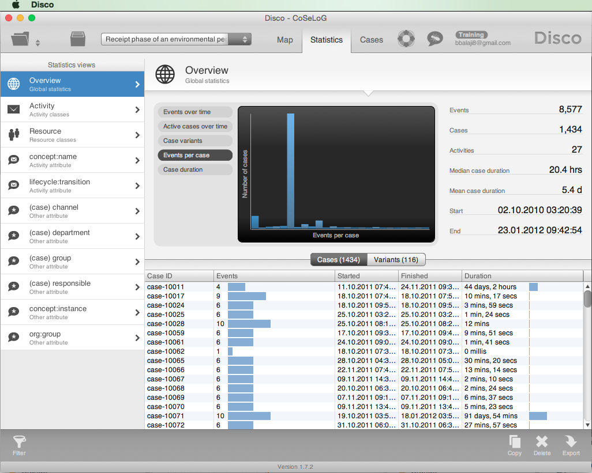

The graph pane displays a histogram (Number of cases) of Events per case in this event log. The event log contains 8,577 events in 1,434 cases with 27 activities.

**My analysis**:  
There are 6 events on average per case. This information can be gathered by hovering the mouse on the tallest bar.

By clicking on "Variants" button on top of the table, we can see that there are only 116 variants amongst the 1,434 cases.

The main observation from the 'Events over time' graph is that the maximum number of events (33) occured on May 2, 2011 across cases.  

### Step 02: inspect process map in Disco
**Approach I used**:  
1. Click on "Map" tab in the window header.  
2. Set "Activities" slider to 0% & "Paths" slider to 50% to make the process map fit on one screen and still be readable.  

**What I saw**: 

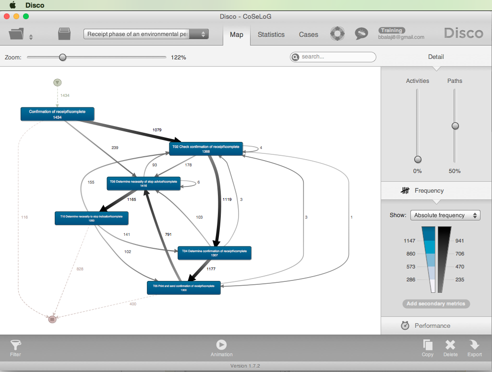


**My analysis**:  

The 6 most frequent activities between the initiation and termination of cases in the process map include:  
A. <TA> Confirmation of receipt  
B. T02 Check confirmation of receipt  
C. T04 Determine confirmation of receipt  
D. T05 Print and send confirmation of receipt  
E. T06 Determine necessity of stop advice  
F. T10 Determine necessity to stop indication

The most frequent activity paths traced by the cases include (this is supposed to display as a table, but doesn't work properly) :  

                                        Activity Path | # of Cases  
----------------------------------------------------- | -----------  
                                   Start -> TA -> End |     116  
              Start -> TA -> T02 -> T04 -> T05 -> End |     400  
Start -> TA -> T02 -> T04 -> T05 -> T06 -> T10 -> End |     828  
                                                      |    
                    Total cases displayed in this map |    1,344  
                                          Total cases |    1,434  
                        % cases displayed in this map |     94%   

Do not understand why if "<TA> Confirmation of receipt" is complete, there is a need for "T02 Check confirmation of receipt". Additionally, there are 4 activities (TA, T02, T04 & T05) regarding confirmation of receipts. Maybe these activities are not named appropriately ? and/or We need to inspect the intermediate activities (e.g. T01, T03) to get a better understanding ?

### Step 03: inspect process performance in Disco

**Approach I used**:  
1. Click on "Performance" bar / button in the "Detail" pane (right above the "Copy" / "Delete" / "Export" icons).  
2. Select "Total Duration" in the "Performance" pane to display.  
3. Select "Case frequency" as the secondary metric in the "Performance" pane to ensure that we don't use outliers (e.g. low case frequency) to make broad conclusions about the process.  
4. Cycle through different metrics in the button next to "Show:" in the Performance pane.  

**What I saw**: 

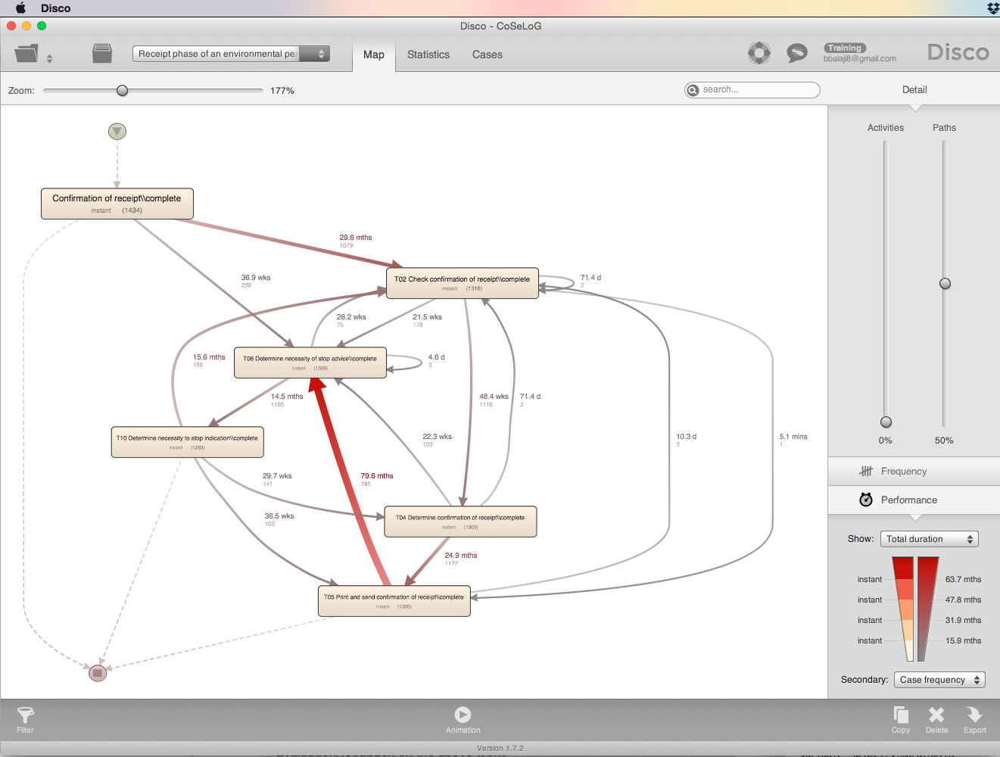

The color & thickness of the arcs are based on the distribution of the selected primary performance metric. Additionally, if an arc is clicked, a statistics window is dsiplayed for that arc.

**My analysis**:  
*Total Duration*: The arc from T05 to T06 takes 79.6 months for 791 cases (31% of total duration of all cases which is 258.12 months: mean of 5.4 days per case X 1,434 cases / 30 elapsed days per month). The next bottleneck seems to be TA -> T02 which is 29.6 months for 1,079 cases.

Analysis of other metrics (median, mean & max duration) highlighted arcs with very low case frequency.

### Step 04: inspect event log in ProM

**Approach I used**:
   
1. Click on "import..." icon on the upper right hand side of the "Workspace" pane.  
2. Click on eye icon (the one associated with the log in the middle; NOT the top one).    
3. Click on "Create new..." droplist in the top center of the window.  
4. Select "XDotted Chart" by scrolling down the list.
5. Select "Dotted Chart" tab on the left.
6. Select "Occurence of first event" from the droplist for "Case order:" option.  
7. Click on "Apply Settings" button.  

**What I saw**: 

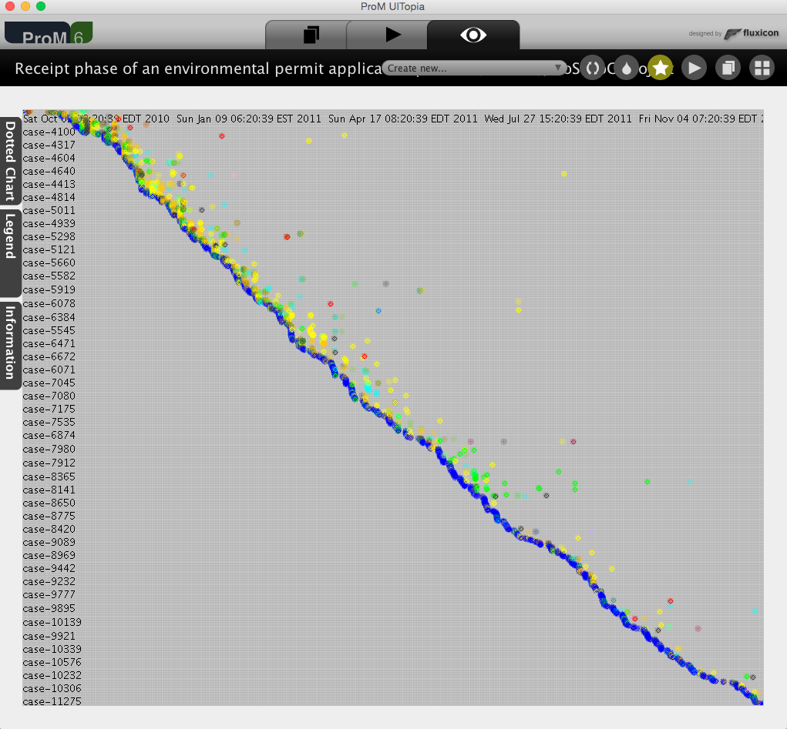

Events for each case are plotted across time and color-coded. Did not see the 'size shows # of events'-option. Zooming in does not make the timeline any more readable / discernible (e.g. do events initiate on weekends ?) 

**My analysis**:  
The arrival of the new cases is fairly constant evidenced by the -45 degree slope of the (approx) line of blue dots. There are some minor fluctuations which is difficult to quantify (clicking on the dots does not display any additional information). 

For the more recent cases there are a lot less events / activities occuring close to case initiation compared to the earlier cases. 

### Step 05: discover Petri net in Disco

**Approach I used**:  
  
1. Click on "Actions" icon.  
2. Add imported event log to "Input".  
3. Search for "Alpha" plug-in.  
4. Select "Mine for a Petri Net using Alpha-algorithm". 
5. Click on "Start" button.  

**What I saw**: 

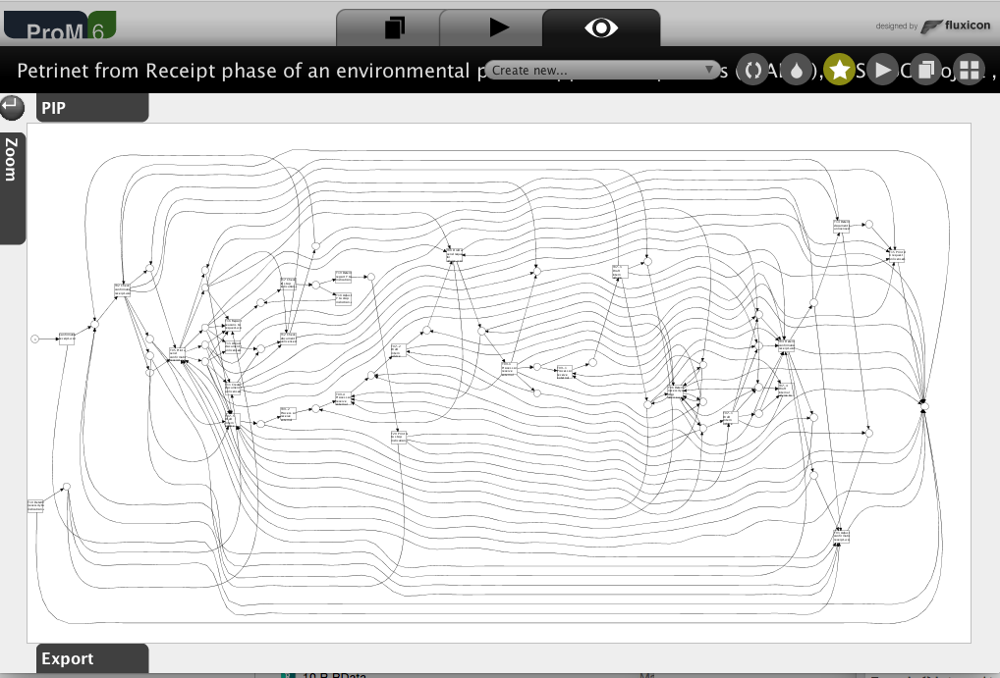  

This is clearly difficult to work with. Let's filter the event log to make it more comprehensible.  

**Approach I used**:  

6. Click on "Actions" icon.  
7. Search for "Filter Log".  
8. Select "Filter Log using Simple Heuristics".  
9. Click on "Start" button. 
10. Change Log name to "CoSeLoG (filtered on simple heuristics)".  
11. Click on "Next" button.
12. Select "Select top percentage" to 100% because there is only 1 Start event.
13. Click on "Next" button. 
14. Select "Select top percentage" to 100% because ideally keeping all End events would be critical in understanding the process.   
15. Click on "Next" button.
16. Select "Select top percentage" to 96% because this Event filter criterion discards many events and therefore many arcs in the resulting Petri net.
17. Change Log name to "CoSeLoG (96% filtered on simple heuristics)".  
18. Click on "Finish" button.  

**What I saw**: 

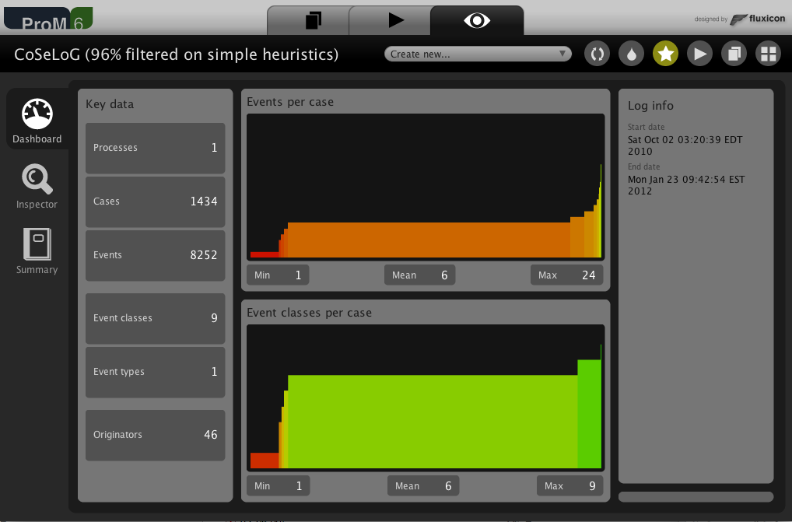 

The number of Event classes has gone down from 27 to 9. The number of Events has reduced from 8,577 to 8,252 but number of Cases remain the same.

**Approach I used**:  

19. Click on "Workspace" icon. 
20. Select "CoSeLoG (filtered...".  
21. Click on "Actions" icon.  
22. Repeat tasks numbered 1-5 listed earlier in this Step. For task 2, select  "CoSeLoG (96% filtered...)" log to "Input".   

**What I saw**: 

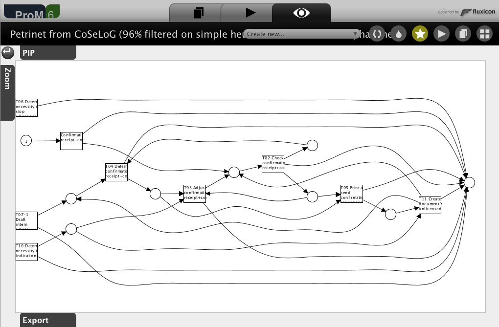  
  
The Alpha algorithm has discovered 9 transactions & 9 places. However, transactions T06, T07-1 & T10 are not integrated well into the rest of the control-flow.     

**Approach I used**:  

23. Click on "Actions" icon.  
24. Add "CoSeLoG (96% filtered...)" log to "Input".  
25. Search for "ILP" plug-in.  
26. Select "Mine for a Petri Net using ILP". 
27. Click on "Start" button.
28. Select the "Number of places" option to "Before & After Transition" instead of "Per Causal Dependency" to ensure clear "End" states & minimize number of arcs. 
29. Click "Finish" button.    

**What I saw**: 

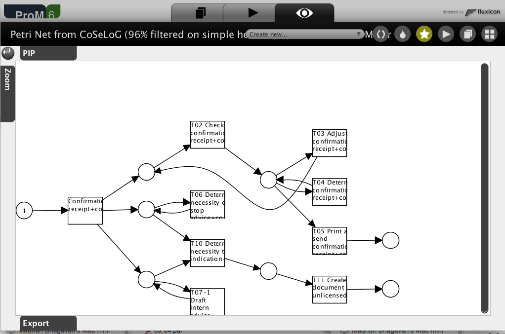

The ILP algorithm has discovered 9 transactions & 8 places. Additionally, the ILP Petri net handles transactions T06, T07-1 & T10 better by not isolating them from the control-flow. 

**Approach I used**:  

30. Click on "Actions" icon.  
31. Add "CoSeLoG (96% filtered...)" log to "Input".  
32. Search for "Heuristics" plug-in.  
33. Select "Mine for a Heuristics Net using Heuristics Miner". 
34. Click on "Start" button.
35. Select the default options and Click "Continue" button.
36. Click on "Zoom" button to the left of the graphic.  
37. Select zoom level next to "Fit >" on the slider to view the net in its entirety.
38. Capture screen image.  
39. Select zoom level to 50% to make the net more readable.  

**What I saw**: 

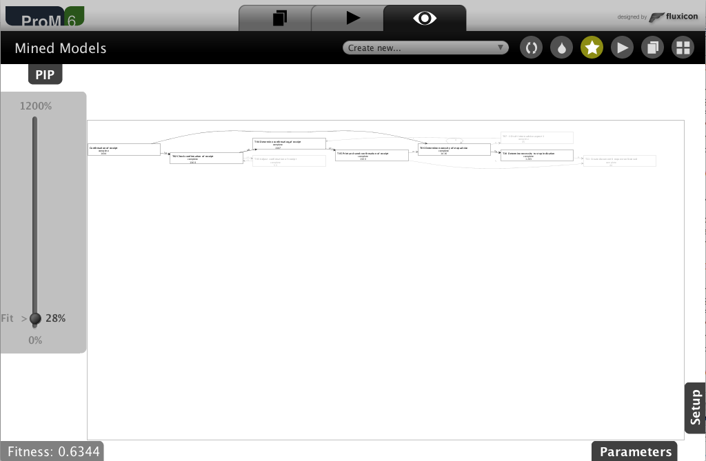

9 transactions are discovered with a fitness score of 0.63 but T03, T07-1 & T11 are grayed out due to low case frequency (<= 55).  

**Approach I used**:  

40. Click on "Workspace" icon.  
41. Select "Mined Models" of type "HeuristicsNet".  
42. Click on "Actions" icon.  
43. Select "Convert Heuristics net into Petri net" plug-in.  
44. Click on "Start" button.  

**What I saw**: 

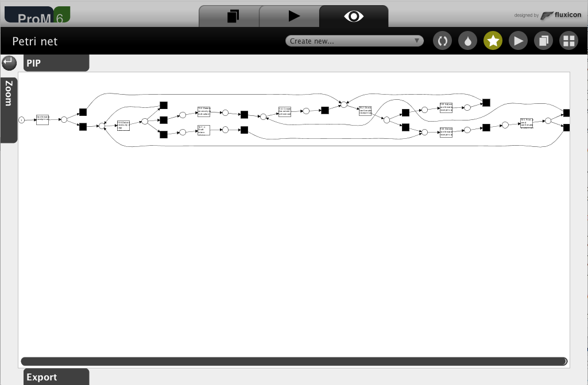

This approach has discovered 9 transactions again, 14 "hidden" / "silent" transactions and 18 places. However, there does not seem to be a clear "End" place.  

**Approach I used**:  

45. Click on "Workspace" icon.  
46. Select "CoSeLoG (96% filtered...)" log.  
47. Click on "Actions" icon.  
48. Search for "Inductive" plug-in.  
49. Select "Mine Petri net with Inductive Miner" plug-in.  
50. Click on "Start" button. 
51. Change "Variant" option from default of "Inductive Miner - infrequent" to "Inductive Miner" because the default option drops T04 transaction probably due to infrequent cases containing it. We want to keep this transaction so that we can compare the different Petri nets with the same set of transactions.  
52. Click "Finish" button.

**What I saw**: 

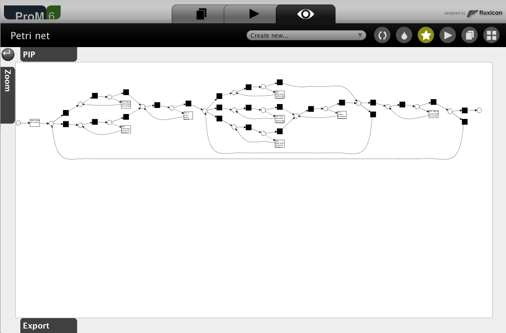

This approach discovered 9 transactions, 25 "hidden" / "silent" transactions & 21 places. 

**My analysis**:

In my opinion, the ILP discovered Petri net is the best based on the following criteria:

'+' Clear Start & End states (ILP, Alpha & Inductive; some combination of options in the Heuristics plug-ins might generate a clear End state too which I did not try due to too many steps).  
'+' Integrate all event log transactions into the control-flow (ILP, Heuristics & Inductive).    
'+' No silent transactions (ILP & Alpha).  
'+' Less arcs (ILP & Heuristics). 

This should be displayed in a table for better readability ?

Since the analysis objective / goal is not known yet, these criteria might be modified when that becomes clear.   


The main traces include:  
**1**. Start -> TA -> T02 -> T05 -> End01 with 2 tokens remaining in ILP3 (between TA & T10) and ILP5 (between TA & T07-1)

**2**. Start -> TA -> T10 -> T11 -> End02 with 1 token remaining in ILP1 (between TA & T02)

The traces with some loops include:  
**1A**. Start -> TA -> T02 -> [T04]* -> T05 -> End01  
    After T02, there might be any number of T04 firings
    
**1B**. Start -> TA -> T02 -> [T03 -> T02]* -> T05 -> End01  
    After T02, there might be any number of T03 -> T02 loops
    
**1AB**. Start -> TA -> T02 -> [T04]* -> [T03 -> T02]* -> T05 -> End01  
    After T02, there might be any number of T04 firings and/or T03 -> T02 loops
    
**2A**. Start -> TA -> [T06]* -> T10 -> T11 -> End02

**2B**. Start -> TA -> [T07-1]* -> T10 -> T11 -> End02

**2AB**. Start -> TA -> [T06]* -> [T07-1]* -> T10 -> T11 -> End02

**2C1a**. Start -> TA -> T10 -> T02 -> [T04]* -> [T03 -> T02]* -> T05 -> End01  
**2C1b**. Start -> TA -> T10 -> T11 -> T02 -> [T04]* -> [T03 -> T02]* -> T05 -> End01  

**2AC1a**. Start -> TA -> [T06]* -> T10 -> T02 -> [T04]* -> [T03 -> T02]* -> T05 -> End01  
**2AC1b**. Start -> TA -> [T06]* -> T10 -> T11 -> T02 -> [T04]* -> [T03 -> T02]* -> T05 -> End01  

**2BC1a**. Start -> TA -> [T07-1]* -> T10 -> T02 -> [T04]* -> [T03 -> T02]* -> T05 -> End01  
**2BC1b**. Start -> TA -> [T07-1]* -> T10 -> T11 -> T02 -> [T04]* -> [T03 -> T02]* -> T05 -> End01  

**2ABC1a**. Start -> TA -> [T06]* -> [T07-1]* -> T10 -> T02 -> [T04]* -> [T03 -> T02]* -> T05 -> End01  
**2ABC1b**. Start -> TA -> [T06]* -> [T07-1]* -> T10 -> T11 -> T02 -> [T04]* -> [T03 -> T02]* -> T05 -> End01  

All the traces that end in End01 have 2 tokens remaining as described for Trace 1.        
All the traces that end in End02 have 1 token remaining as described for Trace 2.            

These traces should be in a table for better comprehension ?

### Step 06: inspect conformance with normative model in ProM

**Approach I used**: 

1. Click on "Workspace" icon.  
2. Click on "import..." button.  
3. Select the normative model file.  
4. Select the 'PNML Petri net files' importer.  
5. Click on "Actions" icon.  
6. Search for "Replay" plug-in.  
7. Select ‘Replay a Log on Petri Net for Conformance Analysis’ (not the variant with performance!) plug-in.
8. Add original event log to "Input".  
9. Click on "Start" button.  
10. Click 'yes' in the 'No Final Marking' pop-up.
11. Select the 'sink' place on the left (note: do not select '0-sink' etc.) and click the button 'Add Place >>' to add the place 'sink' to the candidate final marking list. 
12. Click 'Finish' in the mapping wizard.  
13. Click 'Finish' .  
14. Click 'No, I've mapped all necessary event classes' to indicate that some events are not present in the normative model.  
15. Click 'Next'.  
16. Click 'Finish'.  

**What I saw**: 

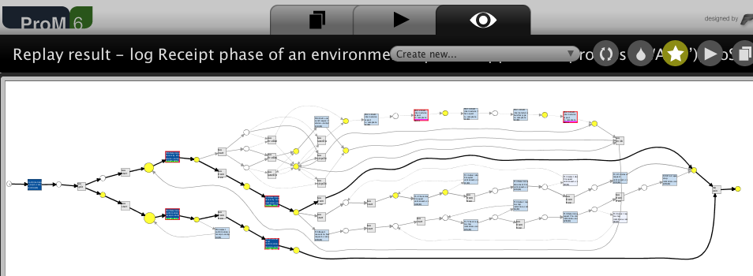

*Transitions*: Most of the traces pass through very few "labeled" (tau are "silent") transitions: TA -> T06 -> T10 & TA -> T04 -> T05. The color darkness or "fill" of the transition boxes is based on the number of traces in the event log that fire them. The numbers underneath the label in the transition boxes refer to the number of synchronous moves vs. "move on model". T13 & T18 are never fired in this event log.  

*Places*: Place size displays "move on log" frequency. Places where move log occured are colored yellow. However, size of "source" & "sink" are not adjusted. Clicking on the place displays the underlying label. Size of places going to silent transitions are not adjusted with frequency but are colored yellow when there are move(s) on log.  

*Arcs*: The thickness of the arcs seems proportional to the frequency of event log traces.   

**My analysis**:  

The replay fitness (the 'trace fitness' statistic) of the event log on the normative process model is 0.8425. T10 has the maximum deviations (151). T06 has the minimum (125). 

The transition 'T06 Determine necessity of stop advice+complete' (on the top left of the model) was tested with 1,434 traces in the event log. Out of those 1,309 (91%) were synchronous moves in both the model & log. Amongst those 1,309 traces, T06 was fired synchronously for 1,327 times (i.e. some traces fired T06 fired multiple times). For 125 traces, T06 was fired in the model only. 

### Step nn: step title

**Approach I used**:  

**What I saw**: 


**My analysis**:  