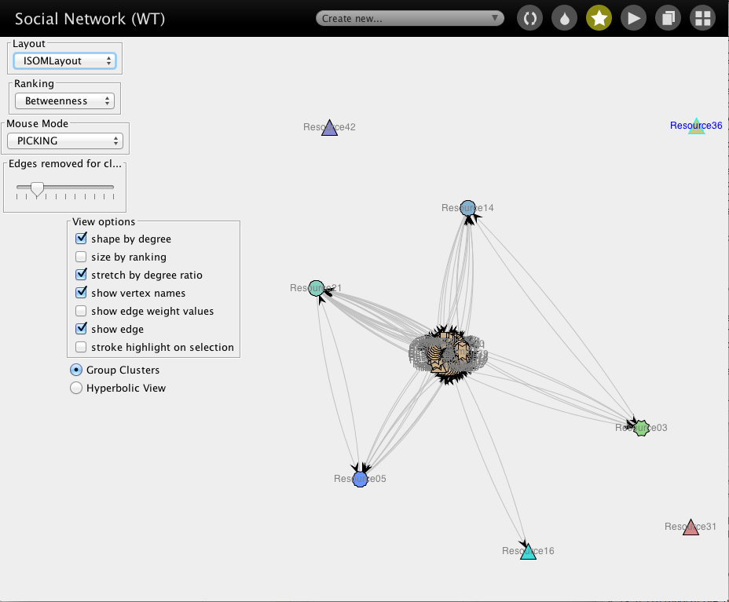
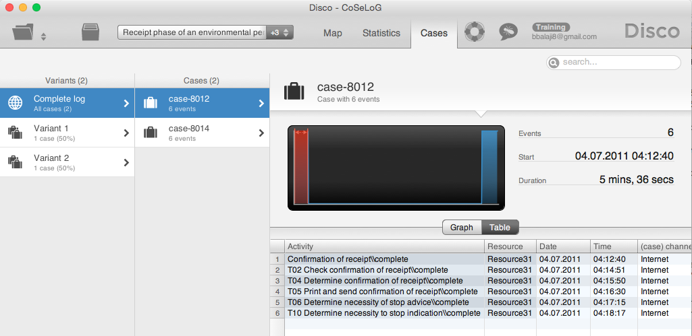
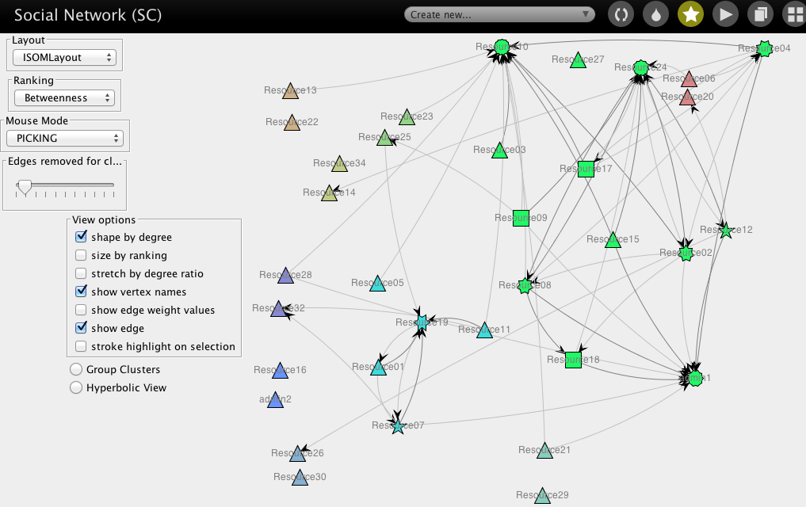
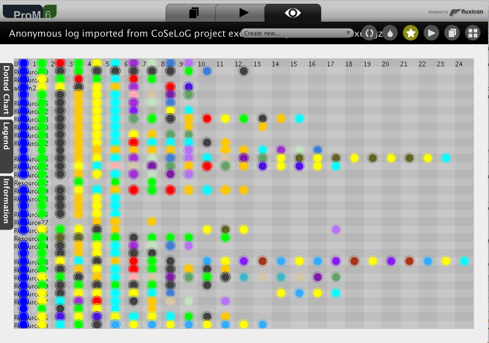

  
**  **    
**Date: `r format(Sys.time(), "(%a) %b %d, %Y")`**    

# Background:

Data: Originates from the CoSeLoG project executed under NWO project number 638.001.211. Within the CoSeLoG project the (dis)similarities between several processes of different municipalities in the Netherlands has been investigated. This event log contains the records of the execution of the receiving phase of the building permit application process in an anonymous municipality.

Source: http://data.3tu.nl/repository/uuid:a07386a5-7be3-4367-9535-70bc9e77dbe6

Time period: 2010-10-02 to 2012-01-23

# Synopsis:

Based on analysis utilizing process mining techniques, the CoSeLoG process may be enhanced with the following recommendations:

1. Normative Model Enhancements:  

    1.1 Rename transitions / tasks / activities to highlight nature of activity rather than working on a "receipt" e.g. T00 ("Confirmation of receipt") & T01 through T05.

    1.2 Review need for many "silent" transitions & places. For e.g. "0 sink", first "tau split" and the immediately succeeding places called "source" might not be really adding much value, especially if it's required more for process analytics rather than the actual business needs / process.

    1.3. Add guards to decision points utilizing case attributes which were either not available / utilized for this analysis.
    
    1.3. Analyze positive & negative deviations in real-world cases utilizing decision points' guards. Negative deviations should create "alerts" to the appropriate personnel in real-time. Positive deviations should be utilized to enhance the normative model.  
    
2. Bottleneck improvements:  

    2.1 There are 791 cases that take 79.6 months to traverse from T05 to T06 which is approx. 31% of the duration of all cases. However, this path is not allowed by the normative process model. Reducing this duration will have a big impact on the overall process duration.  
    
    2.2 Similarly, there are 1,079 cases that take 29.6 months from T00 to T02 which is also not allowed by the normative process model. 
    
    2.3 To enhance the process and facilitate further analytics, capture transitional information about each task / acitivity (e.g. start, complete, abort, schedule, assign, suspend, resume, withdraw, etc.)
    
3. Resource alloaction / utilization: 

    3.1 Categorize resources into "Generalists" vs. "Specialists" to enhance both efficiency and effectiveness. 
    
    3.2 Implement a Resource Recommendation System that considers resource type & capacity along with case attributes & time deadlines to recommend resources for the next event / activity for the case. Broad design guidelines may include:

    3.2.A Assign cases that require specialists based on case attributes / guards as they evolve in real-time. Once the case is assigned to a specialist, increase accountability by ensuring that case is processed all the way to completion by that specialist only, as much as possible. 
    
    3.2.B If the case does not require a specialist, increase accountability by ensuring that case is processed all the way to completion by that generalist only, as much as possible.
    
    3.2.C Reducing the number of hand-offs (as long as that resource has capacity) will have a higher probability of identifying inherent bottlenecks and other efficiency improvements (e.g. whenever a new resource has to step in for a case, that case needs to be "learnt" by that resource prior to executing any task).
    
## Potential next steps include:

1. Utilize "training" vs. "test" or cross-validation technique(s) to discover different Petri nets and collect the generalization conformance fitness metric. 
2. Compute additional Petri net evaluation metrics e.g. "Simplicity.Entropy"  

1. Discover Petri net in ProM:
    1.1 Add Fitness/Simplicity/Precision/Generalization to Petri net selection criteria.            
    1.2 Add place names to discovered Petri nets.
    1.3 Radar plot of model evaluations.
    1.4 Display remaining tokens in selected Petri net.

X.1 Review questions in Peer Assignment to ensure that all have been answered  
X.2 Re-do listed steps to ensure reproduceability  
X.3 Convert text to tables where appropriate  
X.4 Clean formats to make it more readable
X.5 Scan Peer Assignment Forum for enhancement ideas

```{r set_global_options, echo=FALSE}
rm(list=ls())
set.seed(12345)
options(stringsAsFactors=FALSE)
#source("~/Dropbox/datascience/R/mydsutils.R")
source("~/Dropbox/datascience/R/myplot.R")
source("~/Dropbox/datascience/R/mypetrinet.R")
# Gather all package requirements here
suppressPackageStartupMessages(require(reshape))
suppressPackageStartupMessages(require(plyr))
suppressPackageStartupMessages(require(grid))

#require(sos); findFn("pinv", maxPages=2, sortby="MaxScore")
```

```{r set_global_options_wd, echo=FALSE}
setwd("~/Documents/Work/Courses/Coursera/process-mining/Projects/CoSeLoG")
```

# Import event log in Disco
**Approach I used**:  
1. Import the event log into Disco.  
2. Switch to "Statistics" tab / view  
3. Click on "Overview" button in the left pane under "Statistics views"  
4. Click on "Events per case" button to the left of the graph  

**What I saw**: 


The graph pane displays a histogram (Number of cases) of Events per case in this event log. The event log contains 8,577 events in 1,434 cases with 27 activities.

**My analysis**:  
There are 6 events on average per case. This information can be gathered by hovering the mouse on the tallest bar.

By clicking on "Variants" button on top of the table, we can see that there are only 116 variants amongst the 1,434 cases.

The main observation from the 'Events over time' graph is that the maximum number of events (77) occured on Apr 27, 2011 across cases.  

# Analyze process map in Disco
**Approach I used**:  
1. Click on "Map" tab in the window header.  
2. Set "Activities" slider to 0% & "Paths" slider to 50% to make the process map fit on one screen and still be readable.  

**What I saw**: 


**My analysis**:  

The 6 most frequent activities between the initiation and termination of cases in the process map include:  
A. Confirmation of receipt (labeled as "T00" in the rest of this document)  
B. T02 Check confirmation of receipt  
C. T04 Determine confirmation of receipt  
D. T05 Print and send confirmation of receipt  
E. T06 Determine necessity of stop advice  
F. T10 Determine necessity to stop indication

The most frequent activity paths traced by the cases include:    

```{r step_02, echo=FALSE}

step_02_df <- data.frame("Activity.Path"=c("Start -> T00 -> End",
        "Start -> T00 -> T02 -> T04 -> T05 -> End",
    "Start -> T00 -> T02 -> T04 -> T05 -> T06 -> T10 -> End"),
                         "Cases"=c(                          116,
                                               400,
                                                         828))
print(step_02_df, row.names=FALSE)
```                        

These traces capture `r format((sum(step_02_df$Cases) / 1434) * 100, digits=3)` % of the cases in the event log. There are 4 activities (T00, T02, T04 & T05) regarding confirmation of receipts. Maybe these activities are not named appropriately ? 

# Analyze process performance in Disco

**Approach I used**:  
1. Click on "Performance" bar / button in the "Detail" pane (right above the "Copy" / "Delete" / "Export" icons).  
2. Select "Total Duration" in the "Performance" pane to display.  
3. Select "Case frequency" as the secondary metric in the "Performance" pane to ensure that we don't use outliers (e.g. low case frequency) to make broad conclusions about the process.  
4. Cycle through different metrics in the button next to "Show:" in the Performance pane.  

**What I saw**: 


The color & thickness of the arcs are based on the distribution of the selected primary performance metric. Additionally, if an arc is clicked, a statistics window is displayed for that arc.

**My analysis**:  
*Total Duration*: The arc from T05 to T06 takes 79.6 months for 791 cases (31% of total duration of all cases which is 258.12 months: mean of 5.4 days per case X 1,434 cases / 30 elapsed days per month). The next bottleneck seems to be T00 -> T02 which is 29.6 months for 1,079 cases.

Analysis of other metrics (median, mean & max duration) highlighted arcs with very low case frequency.

# Analyze event log in ProM

**Approach I used**:
   
1. Click on "import..." icon on the upper right hand side of the "Workspace" pane.  
2. Click on eye icon (the one associated with the log in the middle; NOT the top one). 
3. Click on "Create new..." droplist in the top center of the window. 
4. Select "XDotted Chart" by scrolling down the list.
5. Select "Dotted Chart" tab on the left.
6. Select "Occurence of first event" from the droplist for "Case order:" option. 
7. Click on "Apply Settings" button.  

**What I saw**: 


Events for each case are plotted across time and color-coded. Zooming in does not make the timeline any more readable / discernible (e.g. do events initiate on weekends ?) 

**My analysis**:  
The arrival of the new cases is fairly constant evidenced by the -45 degree slope of the (approx) line of blue dots. There are some minor fluctuations which is difficult to quantify (clicking on the dots does not display any additional information). 

For the more recent cases there are a lot less events / activities occuring close to case initiation compared to the earlier cases. 

# Discover Petri net in ProM

## Alpha Algorithm

**Approach I used**:  
  
1. Click on "Actions" icon. 
2. Add imported event log to "Input". 
3. Search for "Alpha" plug-in. 
4. Select "Mine for a Petri Net using Alpha-algorithm". 
5. Click on "Start" button.  

**What I saw**: 

  

This is clearly difficult to work with. Let's filter the event log to make it more comprehensible.  

**Approach I used**:  

10. Click on "Actions" icon. 
11. Search for "Filter Log". 
12. Select "Filter Log using Simple Heuristics". 
13. Click on "Start" button. 
14. Change Log name to "CoSeLoG (filtered on simple heuristics)". 
15. Click on "Next" button.
16. Select "Select top percentage" to 100% because there is only 1 Start event.
17. Click on "Next" button. 
18. Select "Select top percentage" to 100% because ideally keeping all End events would be critical in understanding the process. 
19. Click on "Next" button.
20. Select "Select top percentage" to 96% because this Event filter criterion discards many events and therefore many arcs in the resulting Petri net. 97% filtering results in a much more complex Petri net.  
21. Change Log name to "CoSeLoG (96% filtered on simple heuristics)". 
22. Click on "Finish" button.  

**What I saw**: 

 

The number of Event classes has gone down from 27 to 9. The number of Events has reduced from 8,577 to 8,252 but number of Cases remain the same. Now, let's see if we can discover a simpler Petri net.  

**Approach I used**:  

Repeat actions numbered 1-5 listed earlier in this section utilizing the "CoSeLoG (96% filtered...)" log.   

**What I saw**: 

  
  
The Alpha algorithm has discovered 9 transitions & 9 places. However, transitions T06, T07-1 & T10 are not integrated well into the rest of the control-flow. Collect Petri net evaluation metrics as listed in the Appendix section "Actions to run ProM plug-in "Replay a Log on Petri Net for Conformance Analysis"".  

**My analysis**:  
```{r alpha_metrics, echo=FALSE}

petrinets_df <- data.frame( "Petrinet"=c("Alpha"),
                            "Fitness.Traces"=c(0.8987),
                            "Simplicity.Places.Total"=c(9),
                            "Simplicity.Places.End"=c(1),
                            "Simplicity.Places.Implicit"=c(0),
                            "Simplicity.Trans.Isolated"=c(3),
                            "Simplicity.Trans.Silent"=c(0),
                            "Simplicity.Arcs"=c(4+3+3+2+4+2+3+9),
                            "Simplicity.MDL"=c(1),
                            "Generalization.Conformance"=c(0.8987),
                            "Precision.Behavioral"=c(0.1971))
print(subset(petrinets_df, Petrinet == "Alpha"), row.names=FALSE)
```

Strictly speaking, the "Generalization.Conformance" metric would typically be lower than "Fitness.Traces" if the proper "training" vs. "test" events log technique or the cross-validation technique is utilized for discovering the Petri net and then testing for conformance. This analysis collects this metric for the sake of analysis completeness without utilizing those techniques (a lot of work !). 

## ILP

**Approach I used**:  

1. Click on "Actions" icon. 
2. Add "CoSeLoG (96% filtered...)" log to "Input".  
3. Search for "ILP" plug-in. 
4. Select "Mine for a Petri Net using ILP". 
5. Click on "Start" button.
6. Select the "Number of places" option to "Before & After Transition" instead of "Per Causal Dependency" to ensure clear "End" states & minimize number of arcs. 
7. Click "Finish" button.    

**What I saw**: 


The ILP algorithm has discovered 9 transitions & 8 places ("P 1" & "P 2" are "End" places). Therefore, this Petri net has one implicit place. Additionally, the ILP Petri net handles transitions T06, T07-1 & T10 better by not isolating them from the control-flow. Collect Petri net evaluation metrics as listed in the Appendix section "Actions to run ProM plug-in "Replay a Log on Petri Net for Conformance Analysis"".  

**My analysis**:  
```{r ILP_metrics, echo=FALSE}

petrinets_df <- rbind(petrinets_df, 
                data.frame("Petrinet"=c("ILP"),
                           "Fitness.Traces"=c(0.8483),
                           "Simplicity.Places.Total"=c(8),
                            "Simplicity.Places.End"=c(2),                           
                           "Simplicity.Places.Implicit"=c(1),
                            "Simplicity.Trans.Isolated"=c(0),
                           "Simplicity.Trans.Silent"=c(0),
                           "Simplicity.Arcs"=c(1+3+8+2+5+2),
                           "Simplicity.MDL"=c(3),
                           "Generalization.Conformance"=c(0.8483),
                           "Precision.Behavioral"=c(0.9955)))
print(subset(petrinets_df, Petrinet == "ILP"), row.names=FALSE)
```

## Heuristics Miner

**Approach I used**:  

1. Click on "Actions" icon. 
2. Add "CoSeLoG (96% filtered...)" log to "Input". 
3. Search for "Heuristics" plug-in. 
4. Select "Mine for a Heuristics Net using Heuristics Miner". 
5. Click on "Start" button.
6. Select the default options and Click "Continue" button.
7. Click on "Zoom" button to the left of the graphic. 
8. Select zoom level next to "Fit >" on the slider to view the net in its entirety.
9. Capture screen image. 
10. Select zoom level to 50% to make the net more readable.  

**What I saw**: 


9 transitions are discovered with a fitness score of 0.63 but T03, T07-1 & T11 are grayed out due to low case frequency (<= 55).  

**Approach I used**:  

20. Click on "Workspace" icon. 
21. Select "Mined Models" of type "HeuristicsNet". 
22. Click on "Actions" icon. 
23. Select "Convert Heuristics net into Petri net" plug-in. 
24. Click on "Start" button. 

**What I saw**: 


This approach has discovered 9 transitions again, 14 "hidden" / "silent" transitions and 18 places. However, there does not seem to be a clear "End" place. Apart from the first two places, all the other places could potentially be classified as "End" places ("pi1" is selected as the "End" place for conformance analysis).   

**My analysis**:  
```{r Heuristics_metrics, echo=FALSE}

petrinets_df <- rbind(petrinets_df, 
                data.frame("Petrinet"=c("Heuristics"),
                           "Fitness.Traces"=c(0.7698),
                           "Simplicity.Places.Total"=c(18),
                            "Simplicity.Places.End"=c(16),
                           "Simplicity.Places.Implicit"=c(0),
                           "Simplicity.Trans.Isolated"=c(0),
                           "Simplicity.Trans.Silent"=c(14),
                           "Simplicity.Arcs"=c(1+1+2+4+1+2+2+3+2+2+1+1+1+2+4+1+3+2+2+2+2+1+1+1),
                           "Simplicity.MDL"=c(2),
                           "Generalization.Conformance"=c(0.7698),
                           "Precision.Behavioral"=c(0.8656)))
print(subset(petrinets_df, Petrinet == "Heuristics"), row.names=FALSE)
```

## Inductive Miner
**Approach I used**:  

1. Click on "Workspace" icon. 
2. Select "CoSeLoG (96% filtered...)" log. 
3. Click on "Actions" icon. 
4. Search for "Inductive" plug-in. 
5. Select "Mine Petri net with Inductive Miner" plug-in. 
6. Click on "Start" button. 
7. Change "Variant" option from default of "Inductive Miner - infrequent" to "Inductive Miner" because the default option drops T04 transition probably due to infrequent cases containing it. We want to keep this transition so that we can compare the different Petri nets with the same set of transitions. 
8. Click "Finish" button.

**What I saw**: 


This approach discovered 9 transitions, 25 "hidden" / "silent" transitions & 21 places. The "End" place is named as "sink".  

**My analysis**:  
```{r Inductive_metrics, echo=FALSE}

petrinets_df <- rbind(petrinets_df, 
                data.frame("Petrinet"=c("Inductive"),
                           "Fitness.Traces"=c(0.9813),
                           "Simplicity.Places.Total"=c(21),
                            "Simplicity.Places.End"=c(1),
                           "Simplicity.Places.Implicit"=c(0),
                           "Simplicity.Trans.Isolated"=c(0),
                           "Simplicity.Trans.Silent"=c(25),
                           "Simplicity.Arcs"=c(1+4+6+6+4+3+5+9+9+4+3+4+3+3+3+1),
                           "Simplicity.MDL"=c(13),
                           "Generalization.Conformance"=c(0.9813),
                           "Precision.Behavioral"=c(0.9955)))
print(subset(petrinets_df, Petrinet == "Inductive"), row.names=FALSE)
```

## Select "Best" Petri net

**My analysis**:

The metrics for all the discovered Petri nets:  
```{r Select_Petrinet_1, echo=FALSE}

rownames(petrinets_df) <- petrinets_df$Petrinet
petrinets_df <- subset(petrinets_df, select=-Petrinet)
print(petrinets_df)
```

To consolidate the Simplicity.* metrics into a Simplicity.Score for each Petri net, assign equal weights (as a first approximation) by scaling the raw metric relative to a "perfect" score of 100 since each metric has different scales. For e.g. the minimum value of Simplicity.Places.Total is 8 which may be considered as the "perfect" score amongst these Petri nets. If the minimum value is 0 we add 1 to both numerator & denominator.

```{r Select_Petrinet_2, echo=FALSE, fig.height=7.5}
consolidate_scores <- function(pn_df, metrics, consolidated.metric.name, 
                               perfect_type,
                               metric_weights=NULL) {
    
    if (missing(metric_weights))
        metric_weights <- rep(1.0 / length(metrics), length(metrics))
    
    if (is.null(names(metric_weights)))
        names(metric_weights) <- metrics
    
    for (metric in metrics) {
        min_value <- min(pn_df[, metric])
        max_value <- max(pn_df[, metric])
        
                if (perfect_type == "min") {
            if (min_value == 0) {
                # Add 1 to account for possibility of 0 in denominator
                pn_df[, paste0(metric, ".Scaled")] <- 
                    ((min_value + 1) * 100.0) / (pn_df[, metric] + 1)
            } else {
                pn_df[, paste0(metric, ".Scaled")] <- 
                    ((min_value + 0) * 100.0) / (pn_df[, metric] + 0)
            }
        } else if (perfect_type == "max") {
            if (max_value == 0) {
                stop("max_value == 0")
            } else {    
                pn_df[, paste0(metric, ".Scaled")] <- 
                    (pn_df[, metric] * 100.0) / max_value
            }    
        } else stop(perfect_type, ": invalid argument value")
        
        pn_df[, paste0(metric, ".Weighted")] <- 
            pn_df[, paste0(metric, ".Scaled")] * metric_weights[metric]
    }
    
    for (row in 1:nrow(pn_df)) {
        pn_df[row, consolidated.metric.name] <- 
            weighted.mean(as.numeric(pn_df[row, paste0(metrics, ".Scaled")]),
                          metric_weights)
    }    

    ycol_names <- c(metrics, paste0(metrics, ".Scaled"))
    prefix <- unlist(strsplit(consolidated.metric.name, "[.]"))[1]
    hbar_df <- melt(cbind(data.frame(Petrinet=rownames(pn_df)),
                          pn_df), id="Petrinet", measure=ycol_names)
    hbar_df$variable <- as.character(hbar_df$variable)
    hbar_df$var_type <- sapply(1:nrow(hbar_df), function(row)
            ifelse(length(grep(".Scaled", hbar_df[row, "variable"], fixed=TRUE)) == 0,
                            paste0(prefix, ".Raw"), paste0(prefix, ".Scaled")))
    hbar_df$var_label <- 
        gsub(paste0(prefix, "."), "",
            sapply(1:nrow(hbar_df), function(row)
            ifelse(length(grep(".Scaled", hbar_df[row, "variable"], fixed=TRUE)) == 0,
                            hbar_df[row, "variable"], 
                            gsub(".Scaled", "", hbar_df[row, "variable"], fixed=TRUE))
                    ),
            fixed=TRUE)
    
    if (length(metrics) > 1) {
        gp <- ggplot(hbar_df, aes(x=reorder(Petrinet, value), y=value)) +       
                geom_bar(stat="identity", aes(fill=var_label)) + xlab("Petrinet") + 
                facet_grid(var_label ~ var_type, scales="free") +         
                theme(legend.position="none") + coord_flip()
    } else {
        gp <- ggplot(hbar_df, aes(x=reorder(Petrinet, value), y=value)) +       
                geom_bar(stat="identity", aes(fill=var_type)) + xlab("Petrinet") + 
                facet_wrap(~ var_type, scales="free") +         
                theme(legend.position="none")
    }
    print(gp)

    if (length(metrics) > 1) {
        radar_inp_df <- cbind( data.frame(instance=rownames(pn_df)),
                                        pn_df[, paste0(metrics, ".Scaled")],
                                        data.frame(facet=rep(" ", nrow(pn_df))))
        print(myplot_radar(radar_inp_df))

        print(myplot_hbar(cbind(data.frame("Petrinet"=rownames(pn_df)),
                                pn_df), 
                          "Petrinet", paste0(metrics, ".Weighted")) + 
            scale_fill_discrete("Metrics", 
                labels=gsub(paste0(prefix, "."), "", metrics, fixed=TRUE)))
    }
    
    return(pn_df)
}
petrinets_Simplicity_df <- consolidate_scores(pn_df=petrinets_df, 
        metrics=grep("Simplicity.", names(petrinets_df), fixed=TRUE, value=TRUE), 
        consolidated.metric.name="Simplicity.Score",
        perfect_type="min"
        #, metric_weights=c(0.2, 0.2, 0.2, 0.25, 0.15)
        )
petrinets_Simplicity_df <- cbind(petrinets_Simplicity_df[, 
            -grep("Simplicity.", names(petrinets_Simplicity_df), fixed=TRUE)],
            petrinets_Simplicity_df[, "Simplicity.Score", FALSE])
print(petrinets_Simplicity_df)
```

Based on Simplicity metrics, Alpha & ILP have high scores. Let's create scores for the other categories. The "Raw" vs. "Scaled" horizontal bar graphs should have scaled x-axis but for some reason that is not happening, so let's switch to vertical bar graphs when there is only one metric element to score.

```{r Select_Petrinet_3, echo=FALSE}
petrinets_SF_df <- consolidate_scores(pn_df=petrinets_Simplicity_df, 
        metrics=grep("Fitness.", names(petrinets_df), fixed=TRUE, value=TRUE), 
        consolidated.metric.name="Fitness.Score",
        perfect_type="max")
petrinets_SF_df <- cbind(petrinets_SF_df[, 
            -grep("Fitness.", names(petrinets_SF_df), fixed=TRUE)],
            petrinets_SF_df[, "Fitness.Score", FALSE])
print(petrinets_SF_df)

petrinets_SFG_df <- consolidate_scores(pn_df=petrinets_SF_df, 
        metrics=grep("Generalization.", names(petrinets_df), fixed=TRUE, value=TRUE), 
        consolidated.metric.name="Generalization.Score",
        perfect_type="max")
petrinets_SFG_df <- cbind(petrinets_SFG_df[, 
            -grep("Generalization.", names(petrinets_SFG_df), fixed=TRUE)],
            petrinets_SFG_df[, "Generalization.Score", FALSE])
print(petrinets_SFG_df)

petrinets_SFGP_df <- consolidate_scores(pn_df=petrinets_SFG_df, 
        metrics=grep("Precision.", names(petrinets_df), fixed=TRUE, value=TRUE), 
        consolidated.metric.name="Precision.Score",
        perfect_type="max")
petrinets_SFGP_df <- cbind(petrinets_SFGP_df[, 
            -grep("Precision.", names(petrinets_SFGP_df), fixed=TRUE)],
            petrinets_SFGP_df[, "Precision.Score", FALSE])
print(petrinets_SFGP_df)

radar_inp_df <- cbind( data.frame(instance=rownames(petrinets_SFGP_df)),
                       petrinets_SFGP_df,
                       data.frame(facet=rep(" ", nrow(petrinets_SFGP_df))))
print(myplot_radar(radar_inp_df))

petrinets_SFGP_df$Overall.Score <- sapply(1:nrow(petrinets_SFGP_df), 
    function(row) weighted.mean(as.numeric(petrinets_SFGP_df[row, ]),
                                c(0.30, 0.25, 0.20, 0.25)))
#petrinets_SFGP_df$Overall.Score.Equal <- rowMeans(as.matrix(petrinets_SFGP_df[,1:4]))
hbar_df <- petrinets_SFGP_df[, -grep("Overall.", names(petrinets_SFGP_df), 
                                     fixed=TRUE)] * 
    matrix(rep(c(0.30, 0.25, 0.20, 0.25), nrow(petrinets_SFGP_df)), ncol=4, byrow=TRUE)
print(myplot_hbar(hbar_df, ".rownames", names(hbar_df)) + 
    xlab("Petrinet") + ylab("Overall.Score") + 
    scale_fill_discrete("Categories", 
                        labels=gsub(".Score", "", names(hbar_df), fixed=TRUE)))
print(orderBy(~-Overall.Score, petrinets_SFGP_df))
```

Based on this analysis, the ILP discovered Petri net is the best. Based on other analysis objective(s) / goal(s) the weights of these criteria may be modified.   


## Analyze "Best" Petri net

**My analysis**:

For easier token conformance analysis, let's consolidate the two "End" places into one. 
  
```{r Describe_Selected_Petrinet_1, echo=FALSE, fig.height=5.0}
ILP_pn <- petrinet(name="ILP",
                      trans_df=data.frame(id=1:9,
        name=c("T00","T02","T03","T04","T05","T06","T07-1","T10","T11"),
        x=c(      5,  15,    15,   25,   25,   15,     15,   15,   25),
        y=c(      0,   5,    10,   10,    5,    0,    -10,   -5,   -5)),
                      places_df=data.frame(id=1:7,
        name=c("Start", "ILP1", "ILP2", "ILP3", "ILP4", "ILP5","End"),
        x=c(         0,     10,     20,     10,     20,     10,   30),
        y=c(         0,      5,      5,     -5,     -5,    -10,    0),
        M0=c(        1,      0,      0,      0,      0,      0,    0)),
                      arcs_df=data.frame(
    begin=c("Start",  "T00",  "T00",  "T00"
, "ILP1",  "T02", "T03","ILP2","ILP2","ILP2", "T04","T05"
,          "T10",       "ILP3","ILP4","ILP3", "T06","T11"
, "ILP5","T07-1","ILP5"
),
    end  =c("T00"   ,"ILP1","ILP3","ILP5"
,  "T02", "ILP2","ILP1", "T03", "T05", "T04","ILP2","End"
,         "ILP4",        "T06", "T11", "T10","ILP3","End"
,"T07-1", "ILP5", "T10"
)))
ggplot.petrinet(pn=ILP_pn)
```
   
The main traces with remaining tokens after reaching "End", include:
  
```{r Describe_Selected_Petrinet_2, echo=FALSE, fig.height=5.0}
replay_ILP_lst <- replay.petrisim(ILP_pn, "T00,T02,T05", verbose=FALSE)
ILP_traces_df <- cbind(data.frame(type="1", trace="T00,T02,T05"),
                       t(data.frame(t1=replay_ILP_lst$pn$M)))
print(ILP_traces_df, row.names=FALSE)

replay_ILP_lst <- replay.petrisim(ILP_pn, "T00,T10,T11", verbose=FALSE)
ILP_traces_df <- rbind(ILP_traces_df,
                       cbind(data.frame(type="2", trace="T00,T10,T11"),
                            t(data.frame(t2=replay_ILP_lst$pn$M))))
print(ILP_traces_df, row.names=FALSE)
```

The traces with some loops (depicted as "[transition sequence]*" where the star symbol denotes zero to infinite repetitions) include:

```{r Describe_Selected_Petrinet_3, echo=FALSE, fig.height=5.0}
ILP_traces_df <- orderBy(~type, rbind(ILP_traces_df,
                       cbind(data.frame(type="1A", trace="T00,T02,[T04]*,T05"),
                             subset(ILP_traces_df, type == "1")[, 3:9])))
ILP_traces_df <- orderBy(~type, rbind(ILP_traces_df,
                       cbind(data.frame(type="1B", trace="T00,T02,[T03,T02]*,T05"),
                             subset(ILP_traces_df, type == "1")[, 3:9])))
ILP_traces_df <- orderBy(~type, rbind(ILP_traces_df,
            cbind(data.frame(type="1BA", trace="T00,T02,[T03,T02]*,[T04]*,T05"),
                             subset(ILP_traces_df, type == "1")[, 3:9])))

ILP_traces_df <- orderBy(~type, rbind(ILP_traces_df,
            cbind(data.frame(type="2A", trace="T00,[T06]*,T10,T11"),
                             subset(ILP_traces_df, type == "2")[, 3:9])))
ILP_traces_df <- orderBy(~type, rbind(ILP_traces_df,
            cbind(data.frame(type="2B", trace="T00,[T07-1]*,T10,T11"),
                             subset(ILP_traces_df, type == "2")[, 3:9])))
ILP_traces_df <- orderBy(~type, rbind(ILP_traces_df,
            cbind(data.frame(type="2BA", trace="T00,[T07-1]*,[T06]*,T10,T11"),
                             subset(ILP_traces_df, type == "2")[, 3:9])))
print(ILP_traces_df, row.names=FALSE)

replay_ILP_lst <- replay.petrisim(ILP_pn, "T00,T10,T02,T03,T02,T04,T05", verbose=FALSE)
ILP_traces_df <- orderBy(~type, rbind(ILP_traces_df,
    cbind(data.frame(type="2C1a", trace="T00,T10,T02,[T03,T02]*,[T04]*,T05"),
                        t(data.frame(t12=replay_ILP_lst$pn$M)))))
print(subset(ILP_traces_df, type == "2C1a"), row.names=FALSE)

replay_ILP_lst <- replay.petrisim(ILP_pn, "T00,T10,T11,T02,T03,T02,T04,T05", 
                                  verbose=FALSE)
ILP_traces_df <- orderBy(~type, rbind(ILP_traces_df,
    cbind(data.frame(type="2C1b", trace="T00,T10,T11,T02,[T03,T02]*,[T04]*,T05"),
                        t(data.frame(t12=replay_ILP_lst$pn$M)))))
print(subset(ILP_traces_df, select=-c(Start)), row.names=FALSE)

ILP_traces_df <- orderBy(~type, rbind(ILP_traces_df,
    cbind(data.frame(type="2CA1a", trace="T00,[T06]*,T10,T02,[T03,T02]*,[T04]*,T05"),
                                subset(ILP_traces_df, type == "2C1a")[, 3:9])))
ILP_traces_df <- orderBy(~type, rbind(ILP_traces_df,
    cbind(data.frame(type="2CA1b", trace="T00,[T06]*,T10,T11,T02,[T03,T02]*,[T04]*,T05"),
                                subset(ILP_traces_df, type == "2C1b")[, 3:9])))

ILP_traces_df <- orderBy(~type, rbind(ILP_traces_df,
    cbind(data.frame(type="2CB1a", trace="T00,[T07-1]*,T10,T02,[T03,T02]*,[T04]*,T05"),
                                subset(ILP_traces_df, type == "2C1a")[, 3:9])))
ILP_traces_df <- orderBy(~type, rbind(ILP_traces_df,
    cbind(data.frame(type="2CB1b", trace="T00,[T07-1]*,T10,T11,T02,[T03,T02]*,[T04]*,T05"),
                                subset(ILP_traces_df, type == "2C1b")[, 3:9])))

ILP_traces_df <- orderBy(~type, rbind(ILP_traces_df,
    cbind(data.frame(type="2CBA1a", trace="T00,[T07-1]*,[T06]*,T10,T02,[T03,T02]*,[T04]*,T05"),
                                subset(ILP_traces_df, type == "2C1a")[, 3:9])))
ILP_traces_df <- orderBy(~type, rbind(ILP_traces_df,
    cbind(data.frame(type="2CBA1b", trace="T00,[T07-1]*,[T06]*,T10,T11,T02,[T03,T02]*,[T04]*,T05"),
                                subset(ILP_traces_df, type == "2C1b")[, 3:9])))
print(subset(ILP_traces_df, select=-c(Start)), row.names=FALSE)
```

**2AC1a**. Start -> T00 -> [T06]* -> T10 -> T02 -> [T04]* -> [T03 -> T02]* -> T05 -> End01  
**2AC1b**. Start -> T00 -> [T06]* -> T10 -> T11 -> T02 -> [T04]* -> [T03 -> T02]* -> T05 -> End01  

**2BC1a**. Start -> T00 -> [T07-1]* -> T10 -> T02 -> [T04]* -> [T03 -> T02]* -> T05 -> End01  
**2BC1b**. Start -> T00 -> [T07-1]* -> T10 -> T11 -> T02 -> [T04]* -> [T03 -> T02]* -> T05 -> End01  

**2ABC1a**. Start -> T00 -> [T06]* -> [T07-1]* -> T10 -> T02 -> [T04]* -> [T03 -> T02]* -> T05 -> End01  
**2ABC1b**. Start -> T00 -> [T06]* -> [T07-1]* -> T10 -> T11 -> T02 -> [T04]* -> [T03 -> T02]* -> T05 -> End01  

These traces should be in a table for better comprehension ?

# Analyze conformance with normative model in ProM

**Approach I used**: 

1. Click on "Workspace" icon.  
2. Click on "import..." button.  
3. Select the normative model file.  
4. Select the 'PNML Petri net files' importer.  
5. Click on "Actions" icon.  
6. Search for "Replay" plug-in.  
7. Select ‘Replay a Log on Petri Net for Conformance Analysis’ (not the variant with performance!) plug-in.
8. Add original event log to "Input".  
9. Click on "Start" button.  
10. Click 'yes' in the 'No Final Marking' pop-up.
11. Select the 'sink' place on the left (note: do not select '0-sink' etc.) and click the button 'Add Place >>' to add the place 'sink' to the candidate final marking list. 
12. Click 'Finish' in the mapping wizard.  
13. Click 'Finish' .  
14. Click 'No, I've mapped all necessary event classes' to indicate that some events are not present in the normative model.  
15. Click 'Next'.  
16. Click 'Finish'.  

**What I saw**: 


*Transitions*: Most of the traces pass through very few "labeled" (tau are "silent") transitions: T00 -> T06 -> T10 & T00 -> T04 -> T05. The color darkness or "fill" of the transition boxes is based on the number of traces in the event log that fire them. The numbers underneath the label in the transition boxes refer to the number of synchronous moves vs. "move on model". T13 & T18 are never fired in this event log.  

*Places*: Place size displays "move on log" frequency. Places where move log occured are colored yellow. However, size of "source" & "sink" are not adjusted. Clicking on the place displays the underlying label. Size of places going to silent transitions are not adjusted with frequency but are colored yellow when there are move(s) on log.  

*Arcs*: The thickness of the arcs seems proportional to the frequency of event log traces.   

**My analysis**:  

The replay fitness (the 'trace fitness' statistic) of the event log on the normative process model is 0.8425. T10 has the maximum deviations (151). T06 has the minimum (125). 

The transition 'T06 Determine necessity of stop advice+complete' (on the top left of the model) was tested with 1,434 traces in the event log. Out of those 1,309 (91%) were synchronous moves in both the model & log. Amongst those 1,309 traces, T06 was fired synchronously for 1,327 times (i.e. some traces fired T06 fired multiple times). For 125 traces, T06 was fired in the model only. 

# Analyze resource utilization in ProM

**Approach I used**:  
1. Click on "Workspace" icon.  
2. Select event log resource.  
3. Click on "Actions" icon for this resource.  
4. Search for "Mine for a Subcontracting Social Network" & select it.  
5. Keep selected default options & click on "Continue" button.   
6. Click "Start" button.  
7. Select the following in the Social Network view options:   
    Layout: ISOMLayout   
    Ranking: Betweenness   
    Mouse Mode: Picking  
    Edges removed for cl...: 3rd tick from left  
    View options:  
        shape by degree  
        show vertex names  
        show edge  
        Group Clusters  
8. Select a resource and move it to get more clarity in the visual.          

**What I saw**: 



Resources grouped by cluster, shaped by connectivity degree and edges depicting the connectivity density.   

**My analysis**:  

The resources may be grouped into the following categories:  
I. *Singletons*: Resources {31, 36 & 42} don't and {16} rarely subcontract work.  
II. *Couples*: {05, 21} and {03, 14} are targets of subcontracting and amongst each other within the group. 
III. *General Pool*: All the other resources subcontract work significantly amongst themselves.

Let's see if we can get any more granularity regarding the sub-groups in "General Pool" by inspecting the cases & tasks executed by these resources. Couldn't find an appropriate filter plug-in to do this in ProM. Therefore, I switched to Disco and figured out that I need to  filter the event log to delete cases that the "Singletons" worked on & utilize the remaining cases to re-do this analysis.

**Approach I used**: 

11. Click on "Import" icon in Disco.  
12. Select the event log.  
13. Click on "Filter" icon in the bottom left.  
14. Click in the left pane to add filter.  
15. Select "Attribute - Removes events by attribute".  
16. Select "Resource" in the "Filter by:" option.  
17. Select "Mandatory" in the "Filtering mode:" option.
18. Select "Resource31" only in "Event values:" pane.
19. Click on "Apply filter" button.

**What I saw**: 



2 cases in which all tasks were executed by Resource31.

**My analysis**:  

The "Singletons" worked on 4 cases (10918 for Resource 42; 4328 for Resource 36 & [8012, 8014] for Resource 31) only. Moreover, in each of these cases, all the tasks were conducted by one resource. Similarly, I also found resources {"test" & "TEST"} who each had one case 8061 & 8047. I excluded these cases by applying a filter & exported the filtered event log. 

Re-did tasks 1-8 as listed above for "Step 07: inspect resource utilization in ProM". The clustering in ProM suggested expanding & splitting the "Singletons" group into "Exclusive One-timers" and "Occasional Helpers:" as listed further below. 

After filtering the event log to delete cases that utilize these resources, I re-did the social networking analysis in ProM.

**What I saw**: 



**My analysis**:  

The resources may be grouped into the following categories:  
1. *Exclusive One-timers*: Resources {31, 36, 42, test, TEST} have worked on their cases exclusively (Total 6 cases).  

2. *Occasional Helpers*: Resources {33, 35, 37, 38, 39, 40, 41, 43, admin3}  
    2.1 Resources {40, 41, 43} have helped with one activity on one case each.   
    2.2 Resource37 has helped with 5 activities on one case.  
    2.3 Resource39 has helped with one activity (T02) on 2 cases.  
    2.4 Resource38 has helped with activities on 2 cases.  
    2.5 Resource admin3 has helped with one activity on 3 cases.  
    2.6 Resource33 has helped with T07-* activities on 3 cases.  
    2.7 Resource35 has helped with multiple activities on 3 cases. 
    
    Total 17 cases.
    
3. *Isolated Couples*: Resources {[13, 22], [23, 25], [14, 34], [28, 32], [16, admin2], [26, 30], [21, 29], [06, 20]} occasionally are outsourced / assign work. The cluster sub-groups are probably based on the tasks similarity.

4. *Workgroup A*: Resources {01, 05, 07, 11, 19}

5. *Workgroup B*: Resources {[10, admin1], [04, 24], [02, 03, 08, 09, 12, 15, 17, 18, 27]}  
    5.1 Resources 10 & admin1 are out-scourced work by many resources but do not assign any work to others.  
    5.2 Resources 04 & 24 are out-sourced work by many resources and occassionally assign  work to others.  

For, are all users executing activities from the start of the event log, or are some users joining later? & are users mainly executing particular activities or are most users executing most of the activities?

**Approach I used**:  
21. Click on "Workspace" icon.  
22. Select event log excluding cases that involve *Exclusive One-timers* or *Occasional Helpers*.  
23. Click on "Visualize" icon for the selected resource.  
24. Select "XDottedChart" by clicking on "Create new..." drop-box.  
25. Select "Dotted Chart" tab.  
26. Select the following options:  
    Component: 'org:resource'  
    Time: Logical  
    Case order: Occurence of first event  
27. Click on "Apply settings" button.      

**What I saw**: 



The resources are displayed as rows and the transitions are organized into columns based on when the transition was executed by that resource for a certain case. The transitions are color coded.  

**My analysis**:

Most of the resources are executing activities from the start of the event log. It's hard to identify the exceptions. I wish the chart could be interactive (e.g. click on a dot and obtain more information). 

Most resources are executing the first few activities {T00, T02, T06}. The black color is assigned to multiple activities, so it's hard to tell whether many resources are executing these activities or only a few. Other activities appear to be executed by only a few. 

# Appendix
## Petri net evaluation criteria

Given a Petri net and an event log, the following evaluation criteria (not exhaustive) are useful:

1. Fitness metrics:  
    1.1 Alignment conformance of event log: ProM plug-in Replay a Log on Petri Net for Conformance Analysis w/ option Measuring fitness
            
2. Simplicity metrics:  
    2.1 # total places
    2.2 # end places 
    2.3 # implicit places
    2.4 # isolated transitions
    2.5 # silent transitions  
    2.6 # arcs  
    2.7 Minimal Description Length (MDL): ProM plug-in ?
    2.8 Entropy: ProM plug-in ?  

3. Generalization metrics:  
    3.1 Alignment conformance of "test" (vs. "training") event log (or cross-validation)
            
4. Precision metrics:   
    4.1 Behavioral appropriateness (similar to % model allowed traces present in event log ?): ProM plug-in Replay a Log on Petri Net for Conformance Analysis w/ option Measuring behavioral appropriateness
            
Based on the analysis objective(s), these metrics may be assigned appropriate weights. For this analysis, equal weights were selected i.e. 25% for each metric category and 14.3% for the seven Simplicity metric set elements (Entropy was not computed).

## Actions to run ProM plug-in "Replay a Log on Petri Net for Conformance Analysis"

1. Click on "Actions" icon. 
2. Search for "Replay" plug-in. 
3. Select ‘Replay a Log on Petri Net for Conformance Analysis’ (not the variant with performance!) plug-in.
4. Add event log of interest to "Input". 
5. Add Petri net of interest to "Input". 
6. Click on "Start" button. 
7. If the selected Petri net does not have a clear "End" place:  
    7.1. Click on "Yes" button in the dialog "No final marking is found for this model. Do you want to create one?".  
    7.2. Select the appropriate "End" place(s) from the "List of Places" pane.  
    7.3. Click on "Add Place >>" button.  
    7.4. Repeat actions 7.2 & 7.3 for the remaining "End" places. 
    7.5. Click on "Finish" button.  
    
8. Click on "Finish" button in the "Map Transitions to Event Class" dialog. 
9. Click on "No, I've mapped all necessary event classes" in the "Mapping" dialog. 
10. Select "Measuring fitness" or "Measuring behavioral appropriateness".  
    10.1. For "Measuring fitness":  
        10.1.1. Click on "Next" button.  
        10.1.2. Click on "Finish" button.  
        10.1.3. Click on "Global Statistics (non-filtered traces)".  
        10.1.4. "Trace Fitness" Property displays conformance metric (referenced as 1.1 in the "Petri net evaluation criteria" Appendix section).   
    
    10.2. For "Measuring behavioral appropriateness":  
        10.2.1. Click on "Next" button.  
        10.2.2. Reduce slider for "# Maximum explored states..." to approx. 200 instead of 2,000 to ensure reasonable run-times.  
        10.2.3. Click on "Finish" button.  
        10.2.4. Click on "Global Statistics (non-filtered traces)".  
        10.2.5. "Behavioral Appropriateness" Property displays behavioral appropriateness metric (referenced as 4.1 in the "Petri net evaluation criteria" Appendix section).  

Delete ?:
10. Click 'yes' in the 'No Final Marking' pop-up.
11. Select the 'sink' place on the left (note: do not select '0-sink' etc.) and click the button 'Add Place >>' to add the place 'sink' to the candidate final marking list. 
12. Click 'Finish' in the mapping wizard.  
13. Click 'Finish' .  
14. Click 'No, I've mapped all necessary event classes' to indicate that some events are not present in the normative model.  
15. Click 'Next'.  
16. Click 'Finish'.  
